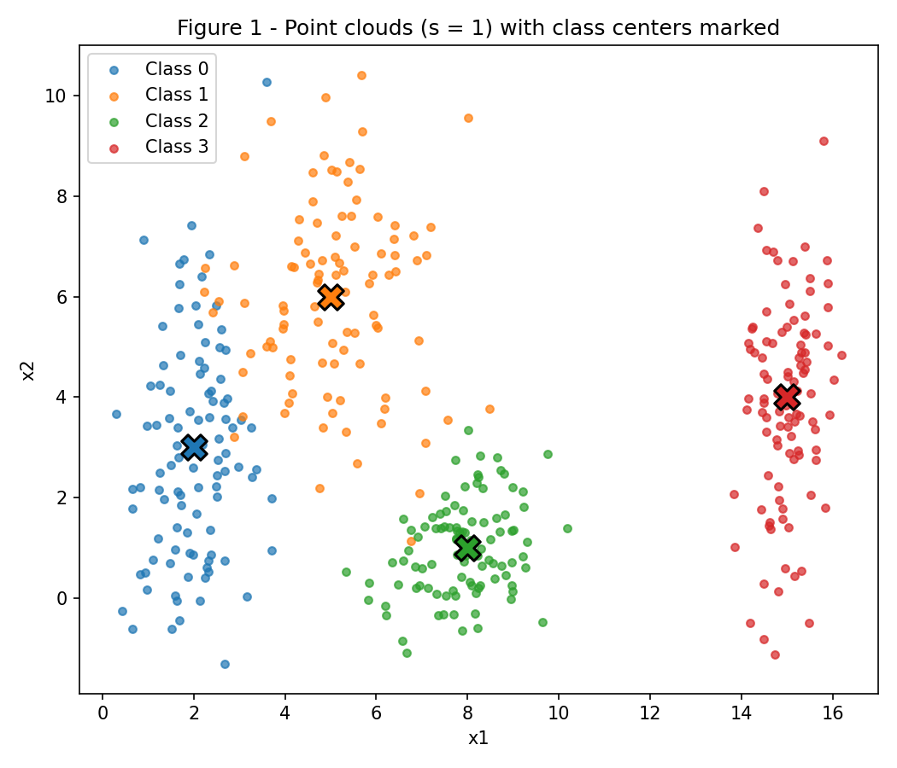
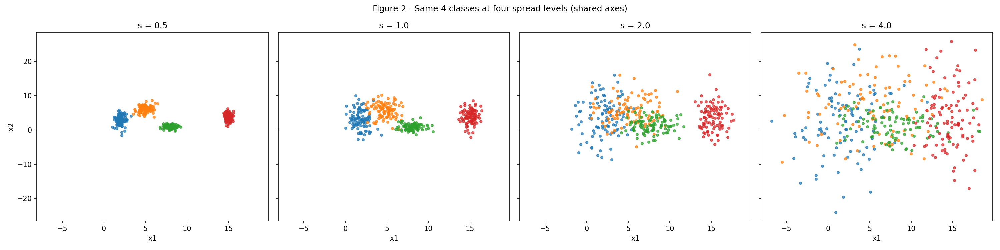
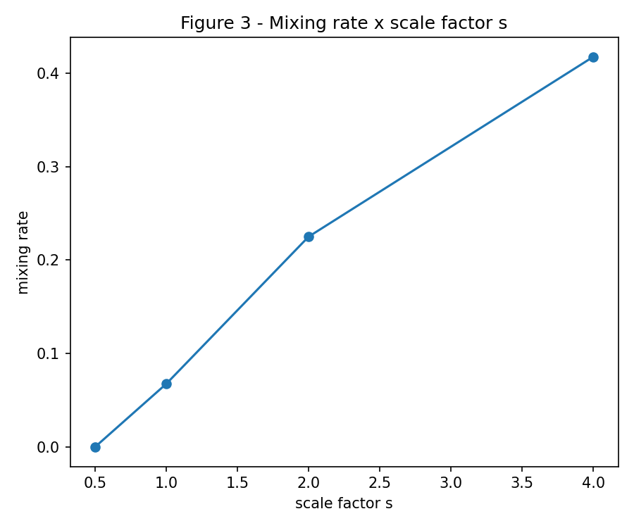
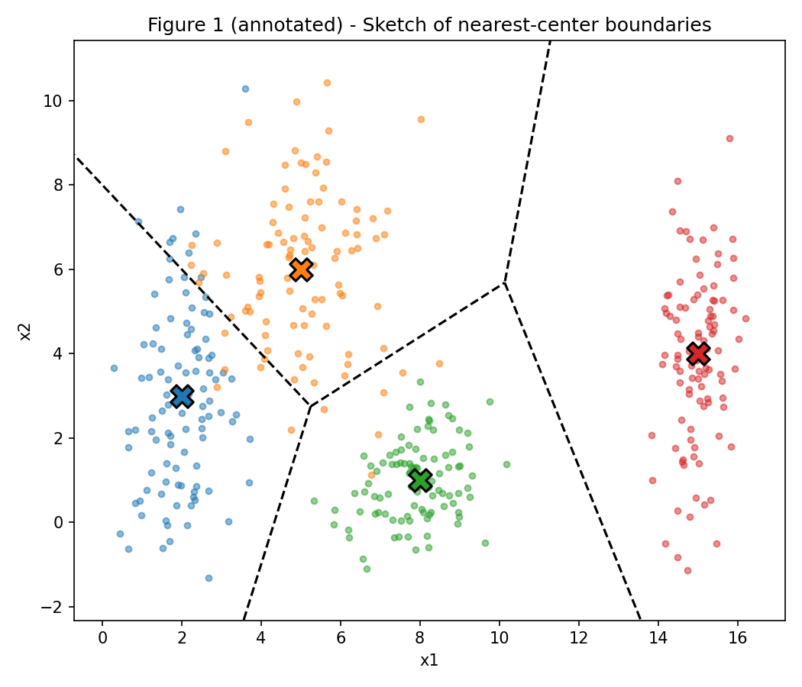
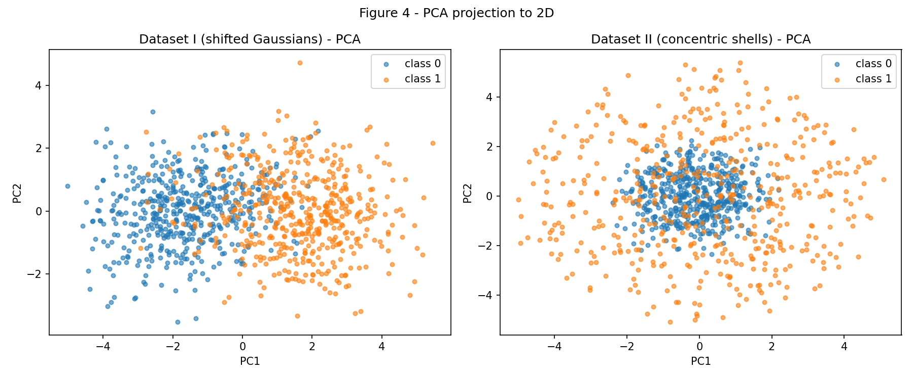
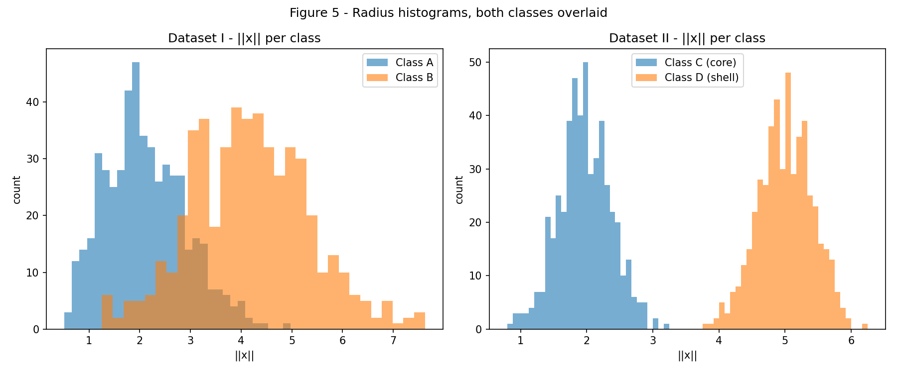
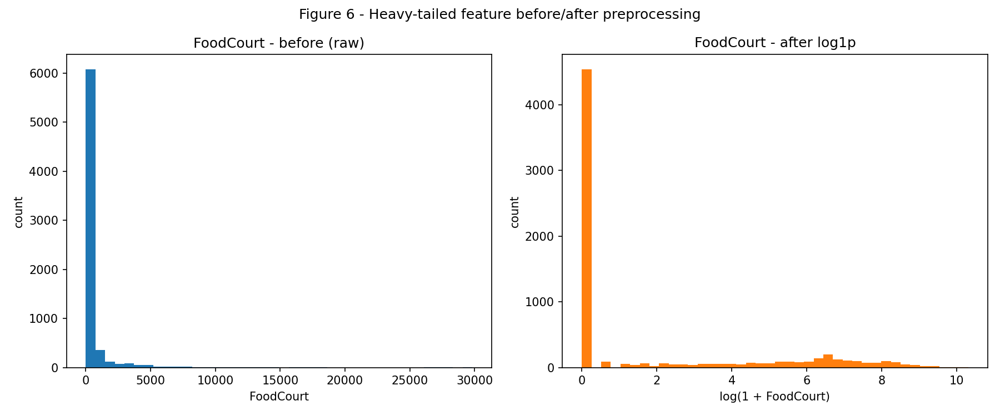

# 1. Data

## Exercise 1

### **Point Clouds: Geometry and Spread in 2D**

### A — Gerar as nuvens

Foram geradas quatro classes de 100 pontos cada, a partir de gaussianas 2D independentes (`rng = np.random.default_rng(42)`), usando as médias e desvios-padrão dados no enunciado.

```python
--8<-- "docs/exercises/data/code/exercise1.py"
```



**Figura 1.** As quatro nuvens no espalhamento original (s = 1), com o centro (média) de cada classe marcado com um X.

### B — Mais ou menos espalhado



**Figura 2.** As mesmas 4 classes regeradas em quatro níveis de espalhamento, compartilhando os mesmos limites de eixo.

**Razão de separação \(r_{ij}\) em \(s = 1\):**

| Par   | \(r_{ij}\) |
| ----- | ---------- |
| (0,1) | 1.3258     |
| (0,2) | 2.4802     |
| (0,3) | 4.4960     |
| (1,2) | 2.3800     |
| (1,3) | 3.6422     |
| (2,3) | 3.5422     |

A menor razão é entre as **classes 0 e 1** (\(r_{01} = 1.3258\)) — o que é coerente com a Figura 1, onde essas duas nuvens são as únicas que visivelmente se tocam.

Como as médias nunca mudam, \(r_{ij}\) escala com \(1/s\). Em \(s = 2\), a menor razão se torna:

\[ r_{01}(s=2) = \frac{1.3258}{2} = 0.6629 \]

**Taxa de mistura por escala:**

| \(s\) | Taxa de mistura |
| ----- | ---------------- |
| 0.5   | 0.0000           |
| 1.0   | 0.0675           |
| 2.0   | 0.2250           |
| 4.0   | 0.4175           |



**Figura 3.** Taxa de mistura em função do fator de espalhamento \(s\).

Em \(s = 0.5\) a taxa de mistura já é zero — todas as nuvens estão totalmente isoladas. Em \(s = 2\) ela já passou de 20%, e o par (0,1) é o responsável: sua razão de separação cai para 0.66 nesse ponto, bem abaixo de 1, o que significa que o espalhamento típico das duas nuvens já é maior do que a distância entre seus centros. É aproximadamente aí que uma única reta deixa de conseguir separar todas as classes com limpeza — as classes 0 e 1 passam a se sobrepor bastante, mesmo que as classes 2 e 3 continuem confortavelmente afastadas em todas as escalas testadas.

### C — Análise

1. Em \(s = 1\), as classes 0 e 1 já se sobrepõem parcialmente (\(r_{01} = 1.33\), a menor das seis razões), enquanto as classes 2 e 3 ficam longe de todo mundo. Uma única fronteira linear não consegue separar as quatro classes de uma vez — mas um **conjunto** de fronteiras lineares (uma por par, como em um esquema um-contra-um ou um-contra-todos) consegue, já que cada par individualmente ainda é separável o suficiente, com poucas exceções.

2. Esboçado como uma partição por centro mais próximo (Voronoi) sobre as quatro médias conhecidas — uma construção geométrica simples, não um modelo treinado, mas uma aproximação razoável do que uma rede otimizando um critério parecido aprenderia:

   

   A fronteira entre as classes 0 e 1 passa exatamente pela região onde as duas nuvens visivelmente se misturam na Figura 1 — coerente com elas terem a menor razão de separação (\(r_{01} = 1.33\)) das seis.

3. Conforme as nuvens se espalham (\(s\) maior), a região de sobreposição entre as classes 0 e 1 cresce, e a taxa de mistura — a fração de pontos mais próxima do centro errado do que do próprio — sobe junto (Figura 3). Qualquer fronteira que uma rede aprenda necessariamente erra dentro dessa região de sobreposição: quanto mais as nuvens se espalham, mais larga fica essa região, e maior o erro irredutível, independentemente de onde a fronteira seja colocada.

---

## Exercise 2

### **Non-Linearity in Higher Dimensions**

### A — Dataset I: gaussianas deslocadas

```python
--8<-- "docs/exercises/data/code/exercise2.py"
```

### B — Dataset II: cascas concêntricas

*(código acima, mesmo arquivo — direções sorteadas uniformemente na esfera unitária de \(\mathbb{R}^5\), depois escaladas por um raio específico de cada classe.)*

### C — Visualizar e comparar



**Figura 4.** Projeção PCA para 2D em ambos os datasets.

**Variância explicada (PC1 + PC2):**

| Dataset | PC1    | PC2    | Soma   |
| ------- | ------ | ------ | ------ |
| I       | 0.5127 | 0.1577 | 0.6704 |
| II      | 0.2159 | 0.2132 | 0.4291 |

A projeção 2D do Dataset I preserva muito mais da estrutura relevante para classificação — os dois primeiros componentes já explicam 67% da variância, e a Figura 4 mostra as duas classes visivelmente deslocadas. O Dataset II mantém menos de 43% da variância em 2D, e as classes aparecem misturadas ali.

**Distância entre centros de classe (5D) e histogramas de raio:**

| Dataset | \(\lVert \mu_1 - \mu_2 \rVert\) |
| ------- | -------------------------------- |
| I       | 3.2643                           |
| II      | 0.2662                           |



**Figura 5.** Histograma de \(\lVert x \rVert\) por classe, ambos os datasets.

### D — Análise

1. No Dataset II os centros de classe são quase coincidentes (0.27 em 5D, contra um raio típico de 2 a 5), mas a Figura 5 mostra as duas distribuições de raio praticamente sem sobreposição. Isso mostra que as classes **não** são linearmente separáveis no sentido usual de "centros separados" — um hiperplano separa com base em uma combinação linear das coordenadas, e uma estrutura radial (simetria esférica) não tem uma direção preferencial para esse plano se alinhar. As duas classes diferem em uma grandeza fundamentalmente não linear (distância até a origem), não em posição.

2. Nenhuma reta — nenhuma fronteira linear, em qualquer orientação — consegue separar o Dataset II, não importa quantos dados sejam coletados, porque as duas classes estão literalmente entrelaçadas em todas as direções: para qualquer hiperplano traçado, ambas as classes têm pontos arbitrariamente próximos dele dos dois lados, já que as duas classes envolvem a origem simetricamente. Só uma fronteira que dependa de \(\lVert x \rVert\) (ou seja, curva e radialmente simétrica) consegue separá-las.

3. Uma projeção PCA 2D que parece misturada **não** prova que as classes são inseparáveis no espaço original — o PCA só captura as direções de maior variância *linear*, e uma estrutura radial não tem uma direção linear dominante para projetar, então o PCA é praticamente a pior ferramenta possível para esse dataset. As classes são trivialmente separáveis usando \(\lVert x \rVert^2 = \sum_i x_i^2\): uma função como \(f(x) = \lVert x \rVert^2 - 10.5\) (aproximadamente na metade entre \(2^2=4\) e \(5^2=25\)) é negativa para a classe do núcleo e positiva para a classe da casca, praticamente sem erros — confirmado pela separação clara nos histogramas da Figura 5.

---

## Exercise 3

### **Preparing Real-World Data for a Neural Network**

### A — Conhecendo os dados

```python
--8<-- "docs/exercises/data/code/exercise3.py"
```

A coluna `Transported` indica se um passageiro foi transportado para outra dimensão durante a colisão — é o alvo binário desta tarefa. As classes estão essencialmente balanceadas: **50.36%** `True` contra 49.64% `False`.

**Tipos de feature:**

- **Numéricas:** `Age`, `RoomService`, `FoodCourt`, `ShoppingMall`, `Spa`, `VRDeck`
- **Categóricas:** `HomePlanet`, `CryoSleep`, `Destination`, `VIP`, `Cabin` (estruturada, descartada depois), `PassengerId` (identificador, descartado), `Name` (identificador, descartado)

**Valores ausentes** (todas as colunas, exceto `PassengerId`/`Transported`, têm entre 2% e 2.5% de ausência):

| Coluna       | Contagem ausente | % ausente |
| ------------ | ----------------- | --------- |
| HomePlanet   | 201                | 2.31      |
| CryoSleep    | 217                | 2.50      |
| Cabin        | 199                | 2.29      |
| Destination  | 182                | 2.09      |
| Age          | 179                | 2.06      |
| VIP          | 203                | 2.34      |
| RoomService  | 181                | 2.08      |
| FoodCourt    | 183                | 2.11      |
| ShoppingMall | 208                | 2.39      |
| Spa          | 183                | 2.11      |
| VRDeck       | 188                | 2.16      |
| Name         | 200                | 2.30      |

**Colunas de gasto — média, mediana, máximo (dataset completo):**

| Coluna       | Média  | Mediana | Máximo |
| ------------ | ------ | ------- | ------ |
| RoomService  | 224.69 | 0.0     | 14327  |
| FoodCourt    | 458.08 | 0.0     | 29813  |
| ShoppingMall | 173.73 | 0.0     | 23492  |
| Spa          | 311.14 | 0.0     | 22408  |
| VRDeck       | 304.85 | 0.0     | 24133  |

Toda coluna de gasto tem **mediana exatamente zero**, enquanto a média fica na casa das centenas — a maioria dos passageiros não gastou nada, e um grupo menor gastou muito, puxando a média bem acima da mediana. Essa diferença é a assinatura de uma distribuição fortemente assimétrica à direita, de cauda pesada.

### B — Dividir antes de transformar

Foi aplicada uma divisão estratificada 80/20 (`train_test_split(..., stratify=y, random_state=42)`) **antes** de qualquer estatística ser calculada. Qualquer média, mediana, lista de categorias ou fator de escala é informação derivada dos dados; se calculada sobre o dataset completo e depois usada para transformar o conjunto de teste, o teste efetivamente "viu" informação de si mesmo durante o pré-processamento, e a avaliação deixa de ser uma estimativa justa de desempenho em dados genuinamente novos. Dividir primeiro e ajustar cada transformação apenas no conjunto de treino mantém o teste honestamente não visto.

### C — Pré-processar

1. **Dados ausentes:** colunas numéricas imputadas com a **mediana** do conjunto de treino (robusta às caudas pesadas já observadas); colunas categóricas imputadas com a categoria **mais frequente** do treino. Os dois imputadores foram ajustados (`fit`) apenas no treino e aplicados (`transform`) nos dois conjuntos.
2. **Codificação categórica:** `HomePlanet`, `CryoSleep`, `Destination`, `VIP` codificadas com one-hot via `OneHotEncoder(handle_unknown="ignore")`. Uma categoria que aparece só no conjunto de teste gera uma linha toda zerada para aquele grupo de feature, em vez de gerar erro — é tratada como "nenhuma das categorias conhecidas", em vez de travar ou reaproveitar silenciosamente estatísticas do treino para ela.
3. **Engenharia de features:** `TotalSpend` é a soma, linha a linha, das cinco colunas de gasto; `Cabin`, `Name` e `PassengerId` foram descartadas (identificadores / strings estruturadas não usadas diretamente).
4. **Caudas pesadas:** `log1p` aplicado às cinco colunas de gasto e ao `TotalSpend`.
5. **Escala:** Padronização (média 0, desvio 1), ajustada apenas no conjunto de treino. Escolhi a padronização em vez da normalização rígida para [-1, 1] porque, depois da transformação logarítmica, os outliers restantes já são bem mais suaves, e a padronização preserva as distâncias relativas entre pontos sem cortar (clip) valores — uma camada oculta com `tanh` ainda recebe entradas concentradas perto de zero, que é o que importa para evitar saturação precoce.



**Figura 6.** `FoodCourt`, conjunto de treino, antes e depois do `log1p`. A feature bruta é dominada por um pico em zero com uma cauda longa e esparsa até ~30.000; depois da transformação, a mesma informação se espalha por uma faixa muito mais tratável.

### D — Verificar e visualizar

- **Checagem de NaN:** 0 valores ausentes tanto na matriz de treino quanto na de teste, já transformadas.
- **Formato final:** treino `(6954, 17)`, teste `(1739, 17)`.
- **Faixa de valores:** conjunto de treino em \([-6.5373,\ 6.5373]\), conjunto de teste na mesma faixa. A maioria dos valores fica bem mais perto de zero (ver o mín/máx das colunas numéricas individuais acima, aproximadamente \([-2, 3]\)); os valores extremos vêm de categorias one-hot raras, onde um único "1" em um grupo pequeno de positivos gera um valor padronizado grande.

Um parágrafo — qual decisão mais afetaria o treinamento: a **transformação logarítmica nas colunas de gasto** é provavelmente a decisão de maior efeito isolado. Sem ela, um punhado de gastadores extremos (até 29.813 em `FoodCourt`) dominaria a escala dessas features mesmo depois da padronização, já que padronizar não remove a assimetria, só recentraliza e reescala — alguns pontos ainda ficariam a muitos desvios-padrão do resto. Com unidades ocultas `tanh`, entradas tão grandes empurram a pré-ativação para bem dentro da região de saturação da função, onde o gradiente é próximo de zero, tornando o aprendizado mais lento especificamente para os passageiros que mais gastaram.

---

## Results summary

| #  | Item                                                                     | Seu valor                           |
| --- | -------------------------------------------------------------------------- | ------------------------------------ |
| 1  | Taxa de mistura em \(s = 0.5\)                                            | 0.0000                              |
| 2  | Taxa de mistura em \(s = 1.0\)                                            | 0.0675                              |
| 3  | Taxa de mistura em \(s = 2.0\)                                            | 0.2250                              |
| 4  | Taxa de mistura em \(s = 4.0\)                                            | 0.4175                              |
| 5  | Menor \(r_{ij}\) em \(s = 1.0\), e qual par                              | 1.3258, par (0, 1)                  |
| 6  | Distância entre centros — Dataset I                                      | 3.2643                              |
| 7  | Distância entre centros — Dataset II                                     | 0.2662                              |
| 8  | Variância explicada PC1 + PC2 — Dataset I                                 | 0.6704                              |
| 9  | Variância explicada PC1 + PC2 — Dataset II                                | 0.4291                              |
| 10 | Proporção da classe positiva em `Transported`                             | 50.36%                              |
| 11 | Média e mediana de `FoodCourt` no conjunto de treino, antes de transformar | média = 452.61, mediana = 0.0       |
| 12 | `shape` final da matriz de features de treino                             | (6954, 17)                          |
| 13 | Mínimo e máximo dos conjuntos de treino e teste após a escala             | mín = -6.5373, máx = 6.5373 (ambos) |
