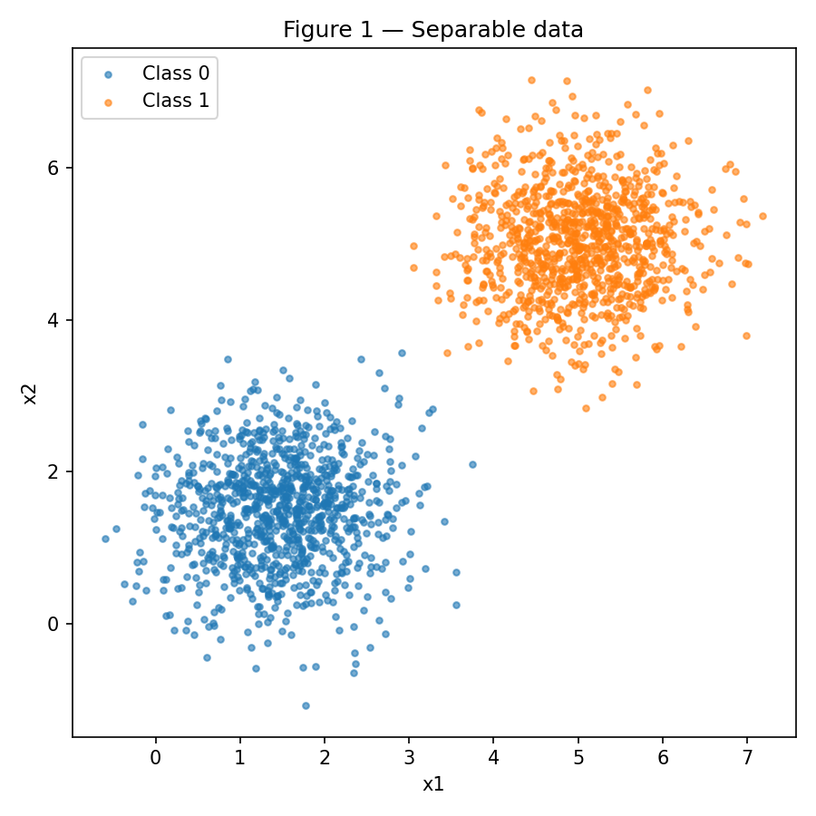
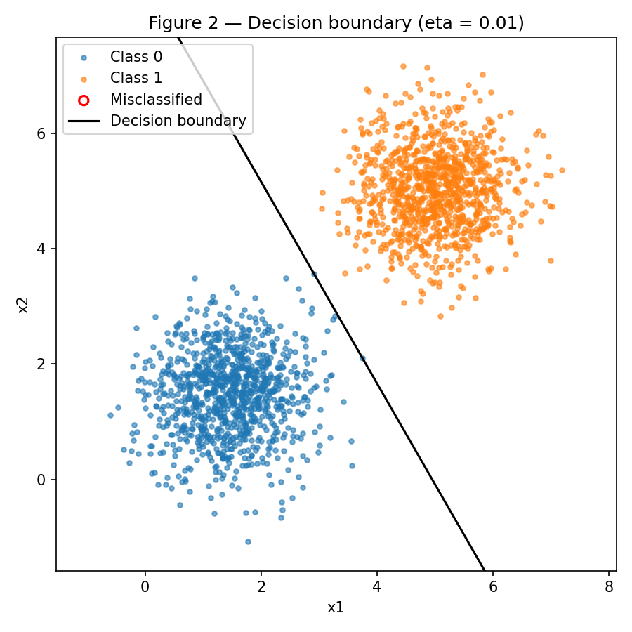
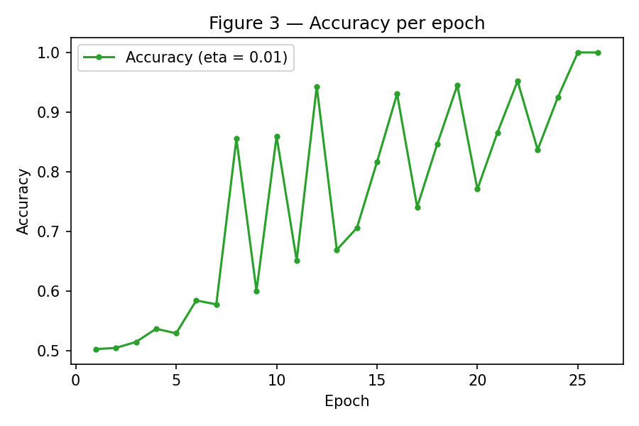
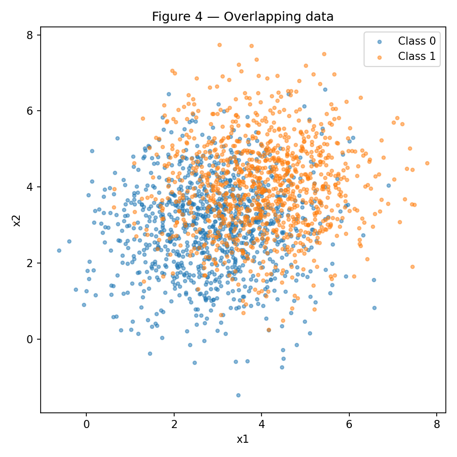
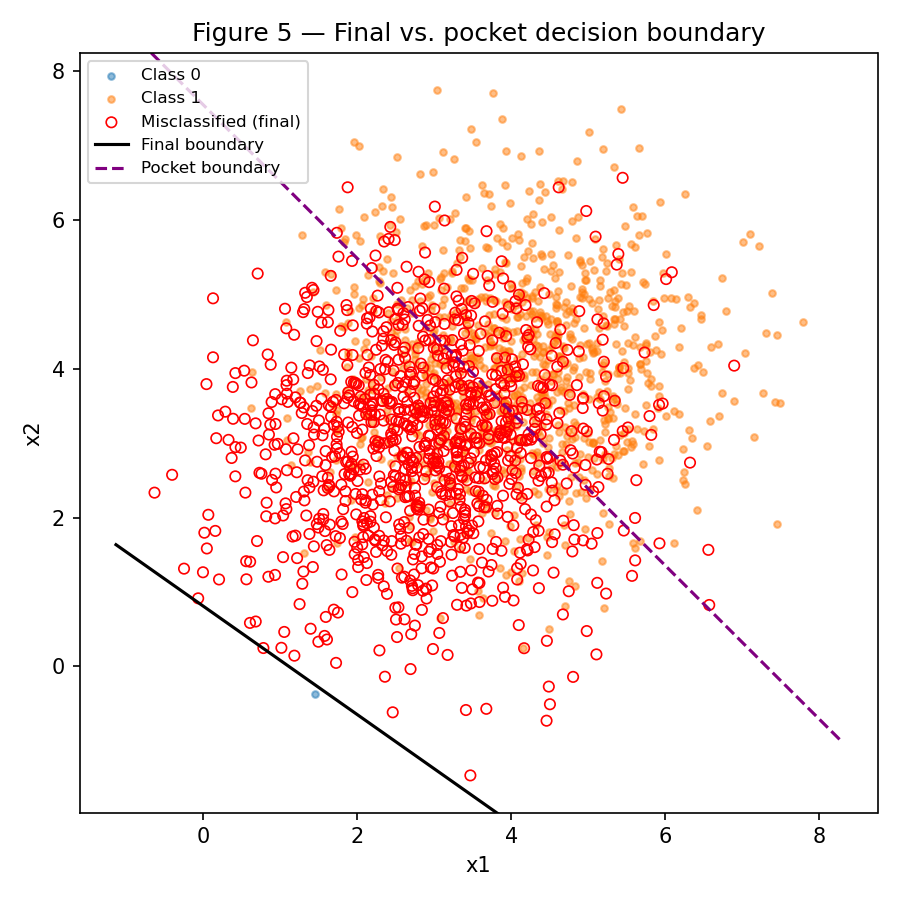
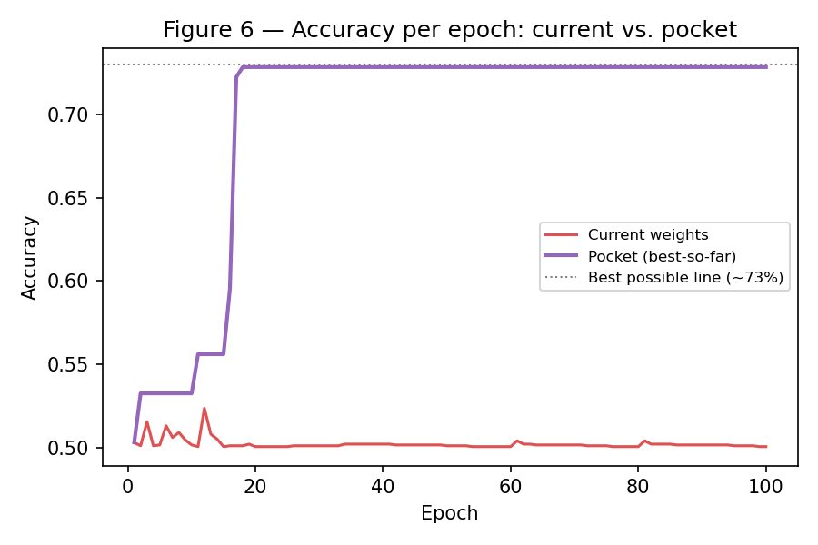

Implementei o perceptron como uma única classe (`Perceptron`, em `code/perceptron.py`), reaproveitada sem alterações entre o Exercise 1 e o Exercise 2 — o algoritmo pocket do Exercise 2 é ligado apenas passando `track_pocket=True` para o mesmo método `fit`, sem duplicar a lógica de treino. As atualizações são feitas amostra a amostra (não vetorizadas), pra ficar fiel ao algoritmo online descrito no enunciado. O principal cuidado na implementação foi o *pocket*: o enunciado pede para comparar a acurácia no conjunto completo a cada atualização (não a cada época), então a verificação do "melhor até agora" acontece dentro do laço interno, logo após cada correção de peso.

## Exercise 1

### **Separable Data: the case the perceptron was designed for**

### A — Generate the data



*(código de geração dos dados no item C, abaixo — o mesmo script produz esta figura)*

### B — Implement the perceptron

```python
--8<-- "docs/exercises/perceptron/code/perceptron.py"
```

### C — Train and measure

Com η = 0.01, inicialização não-nula (w ~ N(0, 0.01), b = 0):

- **w final** = [0.0505, 0.0289]
- **b final** = -0.25
- **épocas até convergência** = 26
- **acurácia final** = 100% (1.0000)

```python
--8<-- "docs/exercises/perceptron/code/exercise1.py"
```





### D — Analysis

**1. Por que dado separável converge rápido?**

A regra de atualização só mexe nos pesos quando ŷ ≠ y — acerto não gera correção. No início, w está com magnitude ~0.01 (praticamente zero), então a fronteira de decisão é essencialmente aleatória e erra uma fração grande dos 2000 pontos, gerando muitas atualizações na primeira época. Cada atualização empurra w e b na direção que corrige aquele erro. Como as duas classes estão bem separadas (médias a 3.5 de distância em cada eixo, desvio-padrão de só ~0.7), a fronteira se aproxima rapidamente de uma posição que separa as nuvens — e à medida que isso acontece, a fração de pontos errados por época despenca, logo o número de atualizações por época também cai. A Figura 3 mostra exatamente isso: depois de um começo instável (a acurácia até oscila, porque correções sucessivas dentro da mesma época podem "passar do ponto" antes de estabilizar), ela sobe e trava em 100% assim que uma época inteira passa sem nenhuma correção — o critério de parada.

**2. Rerun com η = 1.0**

- **w** = [5.0515, 2.4970], **b** = -25.0
- **épocas** = 28
- **acurácia final** = 100%
- **direção w/‖w‖** = [0.8965, 0.4431] (contra [0.8681, 0.4963] com η=0.01) — similaridade de cosseno = **0.9982**

Os dois rodam até 100% de acurácia, mas por fronteiras diferentes (compare os valores absolutos de w e b — cem vezes maiores com η=1.0). O que η controla é o **tamanho do passo** de cada correção: cada atualização soma η·x a um w que começou com magnitude ~0.01. Com η=0.01, esse incremento (~0.01–0.05 por amostra, já que ‖x‖ varia bastante nesse dado) é da mesma ordem do valor inicial de w, então a direção aleatória da inicialização ainda pesa nas primeiras atualizações. Com η=1.0, o primeiro incremento já é ~100× maior que a magnitude inicial — a direção do w inicial é imediatamente "afogada" pela primeira correção baseada em dado real. Ainda assim, como as duas classes têm bastante margem entre si, várias fronteiras diferentes conseguem separá-las perfeitamente, e os dois runs convergem para fronteiras de direção muito próxima (cosseno 0.998) — só a distância no espaço de pesos difere, não fundamentalmente a orientação da fronteira.

**3. Partindo de w = 0, b = 0**

Sejam duas execuções, com taxas \(\eta_1\) e \(\eta_2\), processando as mesmas amostras na mesma ordem, ambas partindo de \(\mathbf{w}_0 = \mathbf{0}\), \(b_0 = 0\). Seja \(c = \eta_2/\eta_1 > 0\).

*Hipótese de indução:* no passo \(t\), \(\mathbf{w}_t^{(2)} = c\,\mathbf{w}_t^{(1)}\) e \(b_t^{(2)} = c\,b_t^{(1)}\).

*Base:* verdadeira em \(t=0\), pois ambos os lados são zero.

*Passo indutivo:* para a amostra \((\mathbf{x}_t, y_t)\),

\[
z^{(2)} = \mathbf{w}_t^{(2)}\cdot\mathbf{x}_t + b_t^{(2)} = c\,(\mathbf{w}_t^{(1)}\cdot\mathbf{x}_t + b_t^{(1)}) = c\,z^{(1)}
\]

Como \(c>0\), \(z^{(1)}\) e \(z^{(2)}\) têm o mesmo sinal, logo \(\text{step}(z^{(1)}) = \text{step}(z^{(2)})\) — **a mesma predição**, o mesmo erro, e portanto a mesma decisão de atualizar ou não nos dois runs. Se houver atualização:

\[
\mathbf{w}_{t+1}^{(2)} = \mathbf{w}_t^{(2)} + \eta_2\,\text{erro}\,\mathbf{x}_t = c\,\mathbf{w}_t^{(1)} + c\,\eta_1\,\text{erro}\,\mathbf{x}_t = c\,\mathbf{w}_{t+1}^{(1)}
\]

e o mesmo para b. A hipótese se mantém por indução, para todo t. ∎

Como as predições coincidem passo a passo, o critério de parada (uma época inteira sem atualização) é atingido exatamente na mesma época nos dois runs — mesma contagem de épocas. E como \(\mathbf{w}_T^{(2)} = c\,\mathbf{w}_T^{(1)}\), \(b_T^{(2)} = c\,b_T^{(1)}\) ao final, a fronteira \(\{\mathbf{x} : \mathbf{w}\cdot\mathbf{x}+b=0\}\) é idêntica nos dois casos (escalar w e b pelo mesmo fator positivo não muda o conjunto de solução da equação). Ou seja: partindo de zero, η só reescalaria os pesos, sem nenhum efeito na fronteira final nem no número de épocas — por isso o item B exige inicialização não-nula.

---

## Exercise 2

### **Overlapping Data: the case the perceptron cannot solve**

### A — Generate the data



### B — Train, keeping the best weights

Mesma implementação do Exercise 1, mesmo η = 0.01, cap de 100 épocas — sem nenhuma alteração no código do perceptron, só a flag `track_pocket=True`.

- **w final** = [0.0361, 0.0494], **b final** = -0.04, **acurácia final** = 50.05% (0.5005)
- **w pocket** = [0.0068, 0.0066], **b pocket** = -0.05, **acurácia pocket** = 72.85% (0.7285), atingida na **época 18**

```python
--8<-- "docs/exercises/perceptron/code/exercise2.py"
```

### C — Figures





### D — Analysis

**1. O gap entre final (~50%) e pocket (~73%)**

O enunciado dá a dica: comparar o quanto b se move por erro contra o quanto w se move, sabendo que ‖x‖≈5 nesse dado. Cada erro atualiza w ← w + η·erro·x, um passo de magnitude ~η·‖x‖ ≈ 0.01×5 = **0.05**; mas atualiza b ← b + η·erro, um passo de só **0.01** — ou seja, w se move cerca de **5× mais rápido** que b a cada correção. Como o dado não é separável, milhares de correções acontecem ao longo das 100 épocas, empurrando w e b para frente e para trás sem nunca parar (as duas classes se sobrepõem tanto que qualquer fronteira erra uma boa fração dos pontos, então o erro nunca some — mais atualizações sempre virão).

O que isso produz, na prática: a distância da fronteira até a origem é \(|b|/\lVert\mathbf{w}\rVert\). Com o w final crescendo ~5× mais rápido que b nesse passeio sem destino, essa razão fica pequena — calculando com os valores obtidos, \(|b|/\lVert\mathbf{w}\rVert \approx 0{,}04/0{,}061 \approx \mathbf{0{,}65}\): a fronteira final passa a menos de 1 unidade da origem. Já a nuvem de dados está centrada em torno de (3,5, 3,5), a ~4,95 unidades da origem. A fronteira final simplesmente não chega perto de onde os dados estão — ela fica plantada num canto vazio do espaço, classificando quase todos os pontos do mesmo lado, o que dá a "acurácia de moeda" (~50%) que o enunciado avisa que é esperada.

Os pesos pocket, por outro lado, foram guardados exatamente no momento em que essa caminhada aleatória passou perto de uma boa fronteira: \(|b|/\lVert\mathbf{w}\rVert \approx 0{,}05/0{,}0095 \approx \mathbf{5{,}25}\) — quase a mesma distância da origem que a própria nuvem de dados. É por isso que o pocket (que apenas *fotografa* o melhor momento) chega perto do ótimo (~73%) enquanto o final (que é só *onde a caminhada aleatória parou*) não tem motivo algum para estar num bom lugar.

**2. Figura 3 vs. Figura 6**

No Exercise 1 a curva de acurácia sobe e **trava** em 100%, porque em algum momento uma época inteira passa sem nenhuma atualização — o critério de parada. No Exercise 2, a curva "current weights" da Figura 6 nunca trava: ela oscila em torno de 50% pelas 100 épocas inteiras, porque essa condição de parada (uma época limpa) nunca acontece — sempre sobra gente do lado errado da fronteira.

O **teorema de convergência do perceptron** garante que, se existe uma fronteira que separa as classes com margem \(\gamma > 0\), o algoritmo converge em um número finito de atualizações (limitado por \((R/\gamma)^2\), com \(R\) o maior \(\lVert\mathbf{x}\rVert\)) para uma solução com **zero erros**. A premissa que esse teorema exige é exatamente a **separabilidade linear** — e é exatamente essa premissa que o dado do Exercise 2 quebra: as duas nuvens se sobrepõem tanto (covariância 3× maior, médias próximas) que nenhuma reta consegue zerar o erro. Sem separabilidade, o teorema simplesmente não se aplica — não há nada garantindo convergência, e o que observamos (oscilação permanente) é a consequência natural disso.

**3. Mais épocas ou η menor resolvem?**

Nenhum dos dois, e dá pra justificar direto pela regra de atualização, sem precisar testar por tentativa e erro:

- **Mais épocas** não ajuda porque o critério de parada é "uma época inteira sem atualização", e isso só acontece quando a fronteira atual classifica 100% dos pontos corretamente. Como nenhuma reta faz isso nesse dado (o próprio enunciado diz que o teto é ~73%), sempre existirão pontos do lado errado em qualquer configuração de w, b — logo sempre haverá pelo menos uma atualização em cada época, para sempre. Rodar 1.000 ou 100.000 épocas só estende a mesma caminhada sem destino.
- **η menor** não ajuda pelo mesmo motivo do item D3 do Exercise 1: reduzir η só reescala o tamanho de cada passo, não muda *quais* amostras são classificadas erradas em cada ponto da trajetória (o sinal de w·x+b, e portanto a predição, não depende da magnitude de η, só da direção acumulada de w e b). Um η menor dá passos menores na mesma caminhada aleatória, mas continua sendo uma caminhada aleatória sem nenhum ponto fixo de baixo erro pra convergir, porque esse ponto fixo simplesmente não existe para dado não-separável.

Em suma: o problema é uma propriedade do **dado**, não do treino — nenhum hiperparâmetro do laço de treino consegue compensar a ausência de uma fronteira linear que realmente separe as classes.

---

## Results summary

| # | Quantity                                                   | Value |
| --- | ---------------------------------------------------------- | ----- |
| 1 | Exercise 1 — final **w** and *b*                | w = [0.0505, 0.0289], b = -0.25 |
| 2 | Exercise 1 — epochs to convergence                         | 26 |
| 3 | Exercise 1 — final accuracy                                | 100% (1.0000) |
| 4 | Exercise 1 — epochs and final accuracy with η = 1.0 | 28 épocas, 100% (1.0000) |
| 5 | Exercise 2 — final **w** and *b*                | w = [0.0361, 0.0494], b = -0.04 |
| 6 | Exercise 2 — accuracy of the final weights                 | 50.05% (0.5005) |
| 7 | Exercise 2 — accuracy of the pocket weights                | 72.85% (0.7285) |
| 8 | Exercise 2 — epoch at which the pocket best occurred       | 18 |
